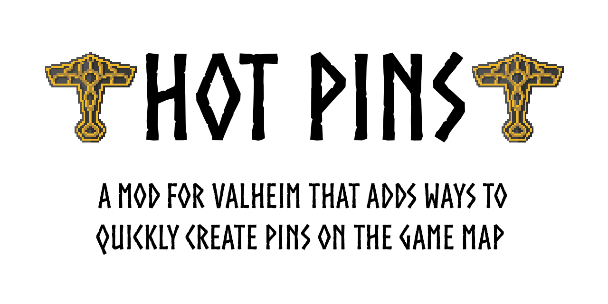

<div align=center>
    
    <br>
    <a href='https://github.com/Andrew-Flame/HotPins/releases/latest'></a>
    
    <a href='https://github.com/Andrew-Flame/HotPins/blob/master/LICENSE'></a>
</div>

---
### Description
'Hot Pins' is a mod for Valheim that adds ways to quickly add markers to the game map.
Have you ever found ore deposits or dungeons while running away from enemies?
What were you doing at that moment?
Maybe you tried to set a pin on the map, risking death, asked your friend to mark this place or just did nothing.
Especially for such cases, I have developed this modification.
Now you can create pins on the game map completely safely in the blink of an eye.
All you need after installing my mod is to use standard keys and keyboard shortcuts (or customize your own) to create pins.

You can create binds to create pins on the game map by linking certain pins to the keys. You can also use the key to automatically mark dungeons (default - G). Then pins will be created for all the dungeons that are close to the player (the radius can be adjusted).

### Demonstration
You can watch the demo by clicking on the [link](https://youtu.be/ZiYrDqpC6Ns)

<a href='https://youtu.be/ZiYrDqpC6Ns' target='_blank'>
    
</a>

### Download
- [Thunderstore](https://valheim.thunderstore.io/package/Flame/HotPins)
- [Nexusmods](https://www.nexusmods.com/valheim/mods/2228)
- [GitHub Releases](https://github.com/Andrew-Flame/HotPins/releases/latest)
<div align=center>
    <a href='https://www.nexusmods.com/valheim/mods/2228'>
        
    </a>
    <a href='https://github.com/Andrew-Flame/HotPins/releases/latest'>
        
    </a>
    <a href='https://valheim.thunderstore.io/package/Flame/HotPins'>
        
    </a>
</div>

### Build from source
You can also build a project from source. To do this , you need to have installed .NET Framework 4.8 or later. Then you need to download the source code from the [latest release](https://github.com/Andrew-Flame/HotPins/releases/latest) and unpack it into any convenient folder. Next, open Powershell in this folder and enter this command:
```
dotnet build --configuration Release
```
After that, the `bin` folder should appear in the current directory. It should have a file called `HotPins.dll`. Then you need to follow the [manual](https://github.com/Andrew-Flame/HotPins#manual) to install the mod

### Default keyboard shortcuts
- Keypad1 = "Hammer" "Burial Chambers"
- Keypad2 = "Hammer" "Troll Cave"
- Keypad3 = "Hammer" "Sunken Crypts"
- Keypad4 = "Hammer" "Frost Cave"
- Keypad5 = "Hammer" "Fuling Village"
- Keypad6 = "Hammer" "Infested mine"
- LeftAlt+Keypad1 = "Ball" "Copper"
- LeftAlt+Keypad2 = "Ball" "Tin"
- LeftAlt+Keypad3 = "Ball" "Guck"
- LeftAlt+Keypad4 = "Ball" "Silver"
- LeftAlt+Keypad5 = "Ball" "Tar"
- LeftAlt+Keypad6 = "Ball" "Marble"

### Manual
1. Unpack the downloaded archive
2. Move the file `HotPins.dll` to the `Valheim/BepInEx/plugins` folder
3. Run the game, it will generate automatically an configuration file into `Valheim/BepInEx/config`

### Customization
- After the first launch of the mod, a config file `Flame.HotPins.cfg` will be created in the `Valheim/BepInEx/config` folder.
- Next, you need to press the bind, you need to make a record of the form: 
- `UnityKeyCode = "Pin Type" "Pin Name"` or `UnityKeyCode1+UnityKeyCode2 = "Pin Type" "Pin Name"` (you can use keyboard shortcuts from multiple keys)
- You can view all [UnityKeyCodes here](https://t.ly/dMe2)
- Available pin types: Fireplace, House, Hammer, Ball, Cave
- As the pin name you can use any string
